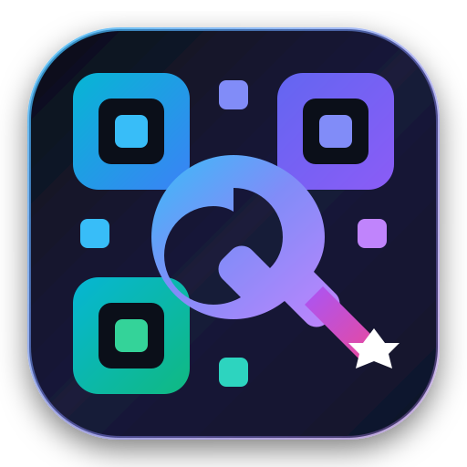

# QRaft — Pro QR Studio & Animated Air-Gapped Transfer

<p align="center">
  
</p>

<p align="center">
  <b>A modern, offline-first Android application built with Jetpack Compose & Material Design 3.</b><br/>
  Features high-precision QR generation, multi-format vector/PDF export, fast live scanning, batch CSV generator, and high-speed animated QR optical data transfer protocol.
</p>

---

## ✨ Features

### 🎨 1. QR Studio & Advanced Customization
- **9 Content Types**: URL, Plain Text, Contact (vCard 3.0), Wi-Fi (SSID, Password, WPA/WEP/None, Hidden), Email, Phone, SMS, Geo Location, and Calendar Event.
- **Deep Styling Matrix**:
  - 8 Handcrafted Color Palettes (Cyber Indigo, Emerald Mint, Sunset Crimson, Midnight Gold, Forest Pine, Neon Violet, Ocean Deep, Monochrome Slate).
  - Gradient Overlays (Linear & Radial), Transparent Backgrounds, and Custom Color Pickers.
  - Dot & Finder Eye Geometries (Sharp Squares, Soft Rounded, Modern Dots).
  - Error Correction Level selection (L ~7%, M ~15%, Q ~25%, H ~30%) with quiet zone control.
  - Center Logo embedding with auto-scaling, badge padding, and official **QRaft SVG Vector Logo**.
  - Frame templates (Scan Me banners, Top/Bottom headers) and custom watermarks.
- **Multi-Format Vector & Document Exporter**:
  - High-res PNG rendering.
  - Clean, standalone SVG vector export with zero quality loss.
  - Printable single-page PDF document generator with metadata header and notes.
  - Native Android Share Intent.

### 📷 2. Real-Time Camera Scanner
- **CameraX + ZXing Pipeline**: Low-latency continuous scanner with responsive focus.
- **Hardware Flashlight Toggle**: Instant torch switch for low-light environments.
- **Contextual Action Sheet**: 1-tap browser launch for URLs, Wi-Fi auto-connect / credentials view, clipboard copy, and direct "Edit in Studio" handoff.

### ⚡ 3. Batch CSV Generator & ZIP Archiver
- **Bulk QR Generation**: Generate dozens or hundreds of QR codes in seconds.
- **Integrated CSV Editor & File Picker**: Pre-loaded with ready-to-use sample templates.
- **Live Progress & Validation**: Real-time per-item syntax validation.
- **ZIP Bundler**: Package all generated codes into a single `.zip` archive or save to local history.

### 🎞️ 4. Animated QR Air-Gapped Data Transfer (Q1 Protocol)
- **Optical Data Diode**: Transfer photos and binary files across air-gapped devices without Wi-Fi, Bluetooth, or Internet.
- **Q1 Protocol Engine**: Automated image downsampling, JPEG/WebP compression, Base64 chunking, and dual-layer CRC32 checksums (`CHUNK_CRC32` & `FULL_SESSION_CRC32`).
- **Interactive Player**: Frame scrubber, play/pause, adjustable FPS (1–15 FPS), and loop controls.
- **Export Formats**: Export transfers as animated GIF or zipped frame sets.
- **Decoder & Reconstructor**: Continuous camera stream analyzer and GIF frame importer with real-time reception tracker, error detection, and instant image restoration.

### 🔒 5. Privacy & Offline Architecture
- **100% Offline-First**: Zero server dependencies; no tracking or external telemetry.
- **Room Database**: Complete local history, custom notes, and reusable design preset manager.
- **Private Analytics Dashboard**: Visual distribution charts for content types and scannability insights.
- **Bilingual & RTL**: Full English & Persian (فارسی) localization with dynamic layout mirroring.

---

## 🛠️ Architecture & Tech Stack

- **UI Framework**: [Jetpack Compose](https://developer.android.com/jetpack/compose) with Material Design 3 (M3).
- **Language**: [Kotlin](https://kotlinlang.org/) (Coroutines, Flow, StateFlow).
- **Architecture**: MVVM + Clean Architecture with Single Activity pattern.
- **Camera & Scanning**: CameraX (`androidx.camera`) + ZXing Core.
- **Persistence**: Room Database (`androidx.room`) with Kotlin Symbol Processing (KSP).
- **PDF & Vector Engines**: Android `PdfDocument`, custom Canvas vector drawables, and native SVG generator.
- **Image Processing**: Android Bitmap Matrix transformation and animated GIF encoding/decoding.

---

## 🚀 Getting Started

### Prerequisites
- Android Studio Ladybug | 2024.2.1 or newer
- JDK 17 or higher
- Android SDK Platform 34 (Android 14)
- Minimum SDK: API 26 (Android 8.0 Oreo)

### Building & Running
1. Clone this repository:
   ```bash
   git clone https://github.com/your-username/qraft-android.git
   ```
2. Open the project in **Android Studio**.
3. Let Gradle sync dependencies.
4. Run the project on an emulator or physical device via Android Studio or command line:
   ```bash
   ./gradlew :app:assembleDebug
   ```

---

## 📄 License
QRaft is released under the **MIT License**.
